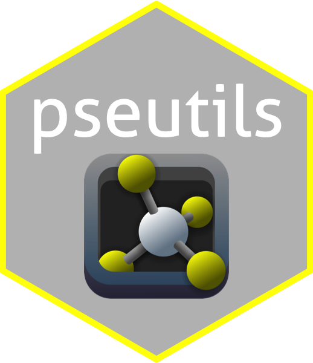
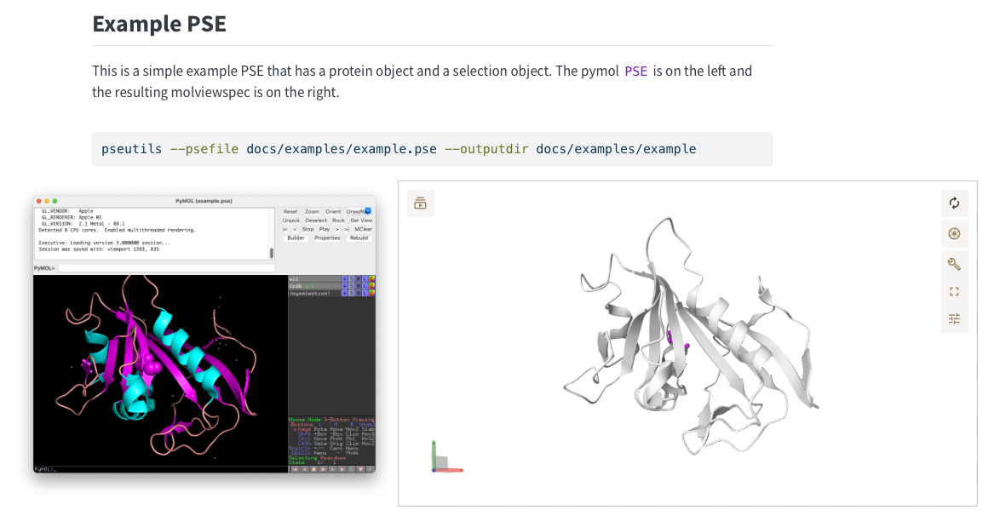

# pseutils


:::: {.columns}

::: {.column width="20%"}

:::

::: {.column width="75%" style="padding-left: 20px;"}
## PSEutils

Convert pymol `.pse` files to [mol-view-spec](https://github.com/molstar/mol-view-spec)/


:::

::::


## Testing

```sh
# build and show docs
just serve

cargo test

# to get all the print statements that are sprinkled around.
cargo test -- --nocapture

# build the docs
cargo clean --doc && cargo doc --no-deps --open

# to look at results
cargo test # generate an example
cd test_temporary && python -m http.server

# build the binary and test
cargo build --release
./target/release/pseutils  --psefile tests/data/example.pse --outputdir binary_test

# outputs a complete directory
> tree binary_test
binary_test
├── index.html
├── molstar.css
├── molstar.js
├── pdb
│   └── 1pdb.pdb
├── pdb_contents.txt
└── state.mvsj


```

## Status

- PSE Conversion to Molstar-ready formula.
- Basic processing of molecules and selections



## Related

- [pymol source](https://github.com/schrodinger/pymol-open-source)
- [mol-view-spec](https://github.com/molstar/mol-view-spec)
- [MichelaNGLo-transpiler](https://github.com/matteoferla/MichelaNGLo-transpiler)
  - [conversion notes](https://github.com/matteoferla/MichelaNGLo-transpiler/blob/master/docs/conversion.md)
  - [view rotation notes](https://github.com/matteoferla/MichelaNGLo-transpiler/blob/master/docs/notes_on_view_conversion.md)
